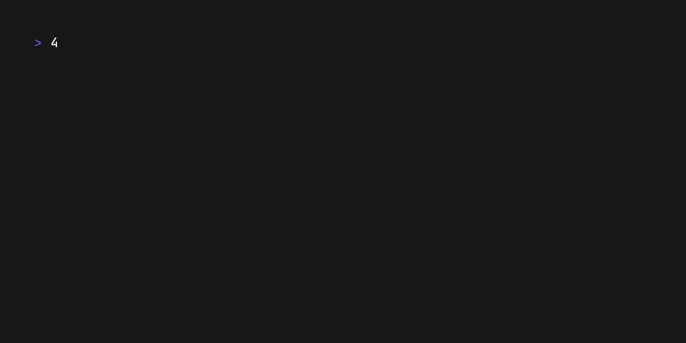

# 42-cli

[](https://github.com/shiftwavedev/42-cli/actions/workflows/ci.yml)
[](https://github.com/shiftwavedev/42-cli/actions/workflows/release.yml)
[](https://goreportcard.com/report/github.com/shiftwavedev/42-cli)
[](https://www.gnu.org/licenses/gpl-3.0)

42-cli brings [42 School](https://42.fr) intranet to your terminal, providing a command-line interface to access public intranet data.

This tool offers an alternative way to interact with 42's systems directly from your terminal.

> [!NOTE]  
> This project is one of my first in Go. So it’s only natural that it’s not perfect (though no project is perfect). Plus, I’m working on it in my spare time, so progress is a bit slow. 

## Preview



## Requirements

- Go 1.25.6 or later (for building from source)
- 42 School account and API credentials

## Installation

### From Release (Recommended)

Download the latest release for your platform from the [releases page](https://github.com/shiftwavedev/42-cli/releases).

### From Source

```bash
# Clone the repository
git clone https://github.com/shiftwavedev/42-cli.git
cd 42-cli

# Download dependencies
go mod download

# Build
go build -o 42-cli

# Or install globally
go install
```

## Quick Start

**Getting API Credentials:**
1. Go to your 42 intranet profile
2. Navigate to API settings
3. Create a new application to get your `client_id` and `client_secret`

### 1. Authentication

First, authenticate with your 42 credentials:

```bash
# Provide credentials directly
42-cli auth login [your_login] [client_id] [client_secret]
```

### 2. Verify Authentication

```bash
# Check if you're logged in
42-cli auth token
```

## Usage

### Authentication Commands

```bash
# Login with 42 credentials
42-cli auth login [login42] [client_id] [client_secret]

# Logout (removes stored credentials)
42-cli auth logout

# Update stored credentials
42-cli auth update [login42] [client_id] [client_secret]

# Display current authentication token
42-cli auth token
```

### General Commands

```bash
# Display version information
42-cli version

# Show help
42-cli --help
```

## Contributing

Contributions are welcome! Please feel free to submit a Pull Request. For major changes, please open an issue first to discuss what you would like to change.

### Development Setup

1. Fork the repository
2. Create your feature branch (`git checkout -b feature/new-feature`)
3. Make your changes
4. Run tests and ensure code quality (`go fmt ./...`, `go vet ./...`, `staticcheck ./...`)
5. Commit your changes using [Conventional Commits](https://www.conventionalcommits.org/)
6. Push to the branch (`git push origin feature/new-feature`)
7. Open a Pull Request

## Security

This application stores your 42 API credentials securely using your system's keyring:
- **macOS**: Keychain
- **Linux**: Secret Service API
- **Windows**: Windows Credential Manager

**Your credentials are never stored in plain text files.**

## Acknowledgments

42-cli is built with these excellent open-source libraries:

- **[Cobra](https://github.com/spf13/cobra)** - A powerful CLI framework for Go
- **[go-keyring](https://github.com/zalando/go-keyring)** - Cross-platform keyring access library

Special thanks to the maintainers and contributors of these projects.

## License

This project is licensed under the GNU General Public License v3.0, see the [LICENSE](./LICENSE) file for details.
